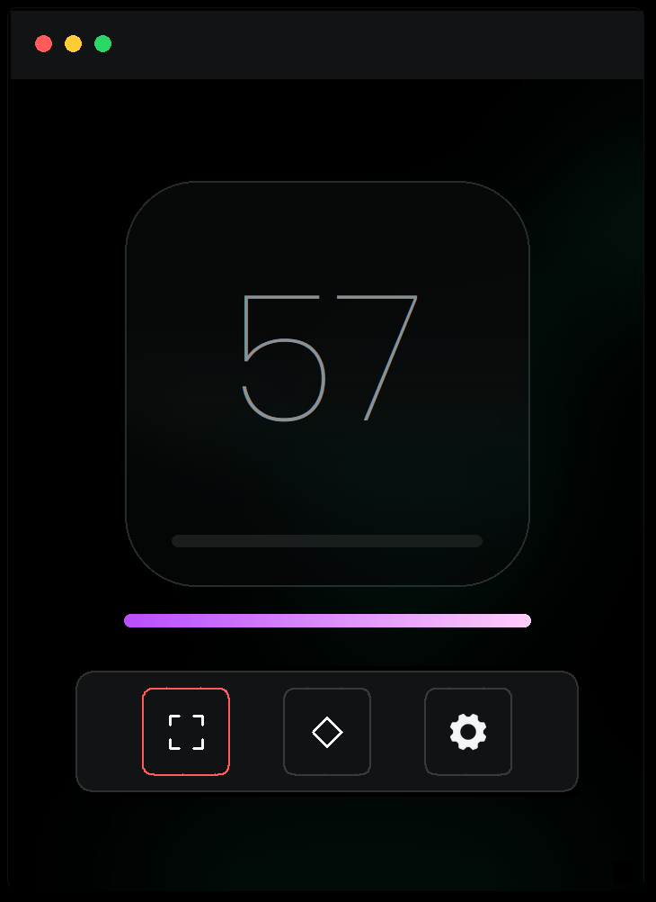
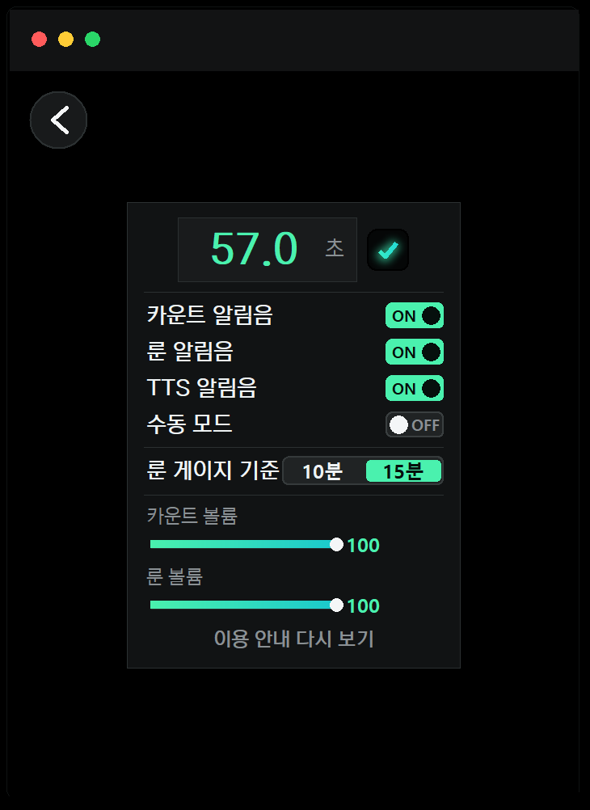

# 룬 타이머 사용 가이드

Windows용 로컬 PiP 룬 알림 및 커스텀 타이머 도구

## 1. 제품 개요

룬 타이머는 메이플스토리 플레이 중 룬 등장 상태와 사용자 지정 타이머를 확인할 수 있도록 만든 Windows용 로컬 PiP 알림 도구입니다. 앱은 사용자가 지정한 미니맵 화면 영역을 PC 내부에서만 분석하며, 룬 아이콘이 표시될 때 알림음을 재생합니다.

게임 클라이언트의 파일, 메모리, 패킷, 키보드 입력, 마우스 입력에는 접근하지 않으며, 별도의 인터넷 연결 없이 동작합니다. 화면 캡처 기반 감지가 부담스러운 경우에는 설정에서 수동 모드를 켜고 순수 타이머 기능만 사용할 수 있습니다.

## 2. 주요 기능

| 기능 | 설명 |
|---|---|
| 룬 감지 | 사용자가 지정한 미니맵 영역에서 룬 아이콘을 확인하고 알림음을 재생합니다. |
| 수동 모드 | 화면 캡처를 사용하지 않고 룬 게이지와 타이머 알림만 사용할 수 있습니다. |
| 커스텀 타이머 | 스킬, 버프, 재획비 등 반복 알림이 필요한 항목을 직접 관리합니다. |
| 위젯 모드 | 사냥 화면을 크게 가리지 않도록 작은 PiP 형태로 사용할 수 있습니다. |

## 3. 빠른 시작

1. 앱을 실행합니다.
2. 하단 왼쪽 캡처 아이콘을 눌러 메이플스토리 미니맵 영역을 지정합니다.
3. 룬이 등장하면 알림음이 재생되고, 앱의 룬 아이콘과 보라색 게이지가 활성화됩니다.
4. 창모드와 전체화면을 전환했거나 미니맵 위치를 바꾼 경우, 룬 영역을 다시 지정합니다.
5. 캡처 없이 쓰고 싶다면 설정 화면에서 수동 모드를 켭니다.

*예시 화면 1. 홈 화면과 하단 조작 버튼*

## 4. 홈 화면 사용법

- 왼쪽 버튼: 미니맵 룬 영역을 직접 지정합니다.
- 가운데 버튼: 수동 모드에서 룬 게이지를 다시 시작할 때 사용합니다.
- 오른쪽 버튼: 알림음, TTS, 수동 모드, 룬 게이지 기준, 볼륨을 설정합니다.
- 보라색 게이지: 룬 처리 이후 다음 룬 등장 가능 시점을 확인하는 보조 표시입니다.

## 5. 설정 화면 사용법

설정 화면에서는 카운트 알림음, 룬 알림음, TTS 알림음, 수동 모드, 룬 게이지 기준, 알림음 볼륨을 조정할 수 있습니다.

*예시 화면 2. 설정 화면의 수동 모드 옵션*

- 수동 모드 OFF: 기본 모드입니다. 지정한 미니맵 화면 영역을 캡처해 룬을 감지합니다.
- 수동 모드 ON: 캡처 스레드와 캡처 객체를 사용하지 않고 순수 타이머로 동작합니다.
- 룬 게이지 기준: 10분 또는 15분 기준으로 룬 등장 예정 알림 시점을 선택합니다.
- 볼륨: 카운트 알림음과 룬 알림음의 크기를 각각 조정합니다.

## 6. 수동 모드

수동 모드는 화면 캡처 자체가 부담스럽거나 불안한 사용자를 위한 분리형 동작 방식입니다. 이 모드에서는 앱이 미니맵을 읽지 않으며, 룬 게이지와 사용자 지정 타이머만 기준으로 알림을 제공합니다.

1. 설정 화면에서 수동 모드를 ON으로 전환합니다.
2. 룬을 처리한 시점을 기준으로 홈 화면 또는 위젯의 룬 아이콘을 누릅니다.
3. 설정한 룬 게이지 기준 시간이 지나면 룬 등장 예정 알림이 최대 3회 재생됩니다.
4. 실제로 룬을 처리한 뒤 룬 아이콘을 다시 눌러 게이지를 재시작합니다.

## 7. 주의 사항

룬 타이머는 메이플스토리 공식 서비스가 아니며, 넥슨 또는 게임 운영사의 공식 허가를 받은 도구가 아닙니다. 이 프로그램은 사용자가 지정한 화면 영역을 분석하는 비공식 보조 도구이며, 사용 여부와 그에 따른 책임은 사용자 본인에게 있습니다.

- 자동 사냥, 스킬 자동 사용, 키보드 입력, 마우스 입력 기능이 없습니다.
- 클라이언트 변조, 패킷 조작, 메모리 접근, 게임 API 사용 기능이 없습니다.
- 기본 모드에서는 사용자가 지정한 화면 영역만 로컬에서 캡처합니다.
- 수동 모드에서는 화면 캡처를 사용하지 않습니다.
- 계정 제재 리스크가 민감한 환경에서는 사용을 권장하지 않습니다.

## 8. 문제 해결

- 룬 알림이 울리지 않으면 미니맵 영역을 다시 지정하고 룬 알림음이 ON인지 확인합니다.
- 창모드와 전체화면을 전환했다면 미니맵 좌표가 달라질 수 있으므로 룬 영역을 다시 지정합니다.
- 소리가 너무 크거나 작으면 설정 화면에서 카운트 볼륨과 룬 볼륨을 각각 조정합니다.
- 캡처가 부담스럽다면 수동 모드를 ON으로 전환해 순수 타이머로 사용합니다.
